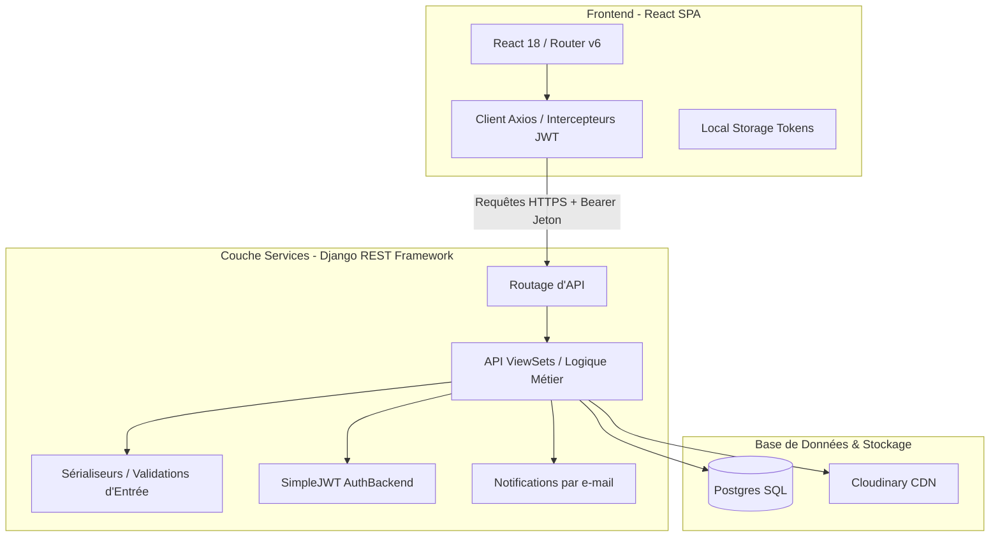

# 📄 Dossier Technique & Rapport de Fin de Projet — Eventify

Ce document constitue le rapport technique officiel du projet **Eventify**. Il offre une description rigoureuse de l'implémentation réelle du système, de ses architectures backend/frontend, de ses structures de données, ainsi qu'une évaluation critique de génie logiciel destinée à un jury ou un comité technique.

---

## 1. Contexte & Objectifs du Système

**Eventify** est une application web de billetterie et de gestion d'événements adaptée aux contraintes et aux usages du marché ouest-africain. Le projet répond à trois besoins clés :
1. **Accessibilité financière** : Prise en charge native de la monnaie locale (**FCFA**) et intégration de flux de paiement par cartes bancaires et Mobile Money (Wave, Orange Money).
2. **Gestion de flux et de jauge** : Algorithmes de files d'attente dynamiques pour réguler l'accès aux places limitées.
3. **Sécurité et confidentialité** : Isolement strict des espaces organisateurs et gestion d'événements privés sur invitation.

---

## 2. Architecture Logicielle & Découpage Applicatif

L'application repose sur une architecture entièrement découplée (Client/Serveur) communiquant via des API REST sécurisées.

### 💻 Stack Frontend
- **Framework** : React 18.2 (compilé via Vite)
- **Routage** : React Router v6 (`createBrowserRouter`)
- **Appels HTTP** : Axios (avec gestion de file d'attente et retry lors du refresh JWT)

### 🐍 Stack Backend
- **Framework** : Django 5.2 & Django REST Framework (DRF) 3.17
- **Authentification** : JSON Web Tokens (SimpleJWT 5.5)
- **Traitement d'Emails** : SMTP Django (avec redirection console en développement)
- **Base de Données** : PostgreSQL en production (SQLite en développement)

---

## 3. Schéma de Base de Données Réel (Modèles Django)

L'ORM Django d'Eventify définit cinq entités principales dans le module [models.py](file:///c:/Users/Lenovo/Downloads/eventify/backend/events/models.py) :

### 3.1 User (`AbstractUser`)
Représente les comptes utilisateurs sur la plateforme.
- `role` (`CharField`) : Choix entre `"participant"` et `"organizer"`. Default: `"participant"`.
- `email` (`EmailField`) : Unique, sert d'identifiant de connexion.
- `phone` (`CharField`) : Numéro de téléphone portable.
- `organization_name` (`CharField`) : Nom de la structure (pour les organisateurs).

### 3.2 Event
Modélise les événements créés sur la plateforme.
- `title` (`CharField`), `description` (`TextField`), `category` (`CharField`).
- `date` (`DateField`) et `time` (`TimeField`, optionnel).
- `location` (`CharField`) : Ville/Région, et `venue` (`CharField`) : Adresse physique exacte.
- `image` (`URLField`) : Lien vers l'image de couverture.
- `is_public` (`BooleanField`) : Flag d'invisibilité publique.
- `allowed_users` (`JSONField`) : Tableau d'e-mails invités pour les événements privés. Default: `list`.
- `places` (`PositiveIntegerField`) : Nombre total de places disponibles.
- `price` (`DecimalField`) et `price_currency` (`CharField`) : Tarification. Default: `0` / `"FCFA"`.
- `status` (`CharField`) : Choix entre `"published"`, `"draft"`, `"cancelled"`. Default: `"published"`.
- `views_count` (`PositiveIntegerField`) : Nombre de consultations de la page.
- `registrations_count` (`PositiveIntegerField`) : Compteur dénormalisé d'inscriptions.

### 3.3 Registration
Gère les inscriptions et réservations des participants.
- `event` & `participant` (clés étrangères pointant vers `Event` et `User`, avec contrainte `unique_together`).
- `status` (`CharField`) : Choix entre `"confirmed"` (place validée), `"pending"` (en attente de paiement, durée de 15 minutes), et `"waitlist"` (file d'attente FIFO). Default: `"confirmed"`.
- `registered_at` (`DateTimeField`) : Horodatage d'inscription (sert de tri pour l'algorithme FIFO).

### 3.4 Payment
Trace les sessions et transactions financières.
- `event` & `participant` (clés étrangères).
- `amount` (`DecimalField`) et `currency` (`CharField`).
- `provider` (`CharField`) : Choix entre `"card"` et `"mobile_money"`.
- `payment_method` (`CharField`) : Ex: `"Wave"`, `"Orange Money"`, `"Carte bancaire"`.
- `phone` (`CharField`) : Numéro de téléphone de prélèvement (Mobile Money).
- `reference` (`CharField`) & `session_id` (`CharField`) : Chaînes uniques d'identification de transaction.
- `status` (`CharField`) : Choix entre `"pending"`, `"completed"`, `"failed"`.
- `metadata` (`JSONField`) : Données supplémentaires (ex: code de confirmation).

### 3.5 Review
Avis et notes laissés par les participants.
- `event` & `participant` (clés étrangères avec contrainte `unique_together` : 1 avis max par participant par événement).
- `rating` (`PositiveSmallIntegerField`) : Note de 1 à 5.
- `comment` (`TextField`).

---

## 4. Algorithmes & Logiques Métiers Fondamentales

### 4.1 Logique FIFO (First-In, First-Out) de la Liste d'Attente
En cas de désistement ou d'augmentation de la jauge d'un événement :
1. Les inscriptions sont créées avec le statut `"waitlist"` dès que la capacité maximale de l'événement (`places`) est atteinte.
2. Le système garantit l'ordre d'arrivée en triant par la date `registered_at`.
3. Lorsqu'un participant annule son inscription confirmée via la route `/api/registrations/cancel_registration/`, le backend exécute `notify_next_on_waitlist()`.
4. Il récupère le premier participant en file d'attente et lui envoie un email l'invitant à finaliser son inscription sous 15 minutes.

### 4.2 Expiration des Sessions de Réservation
Pour éviter que des places soient bloquées indéfiniment par des utilisateurs n'allant pas au bout du paiement :
1. Une session de paiement avec statut `"pending"` est valable pendant **15 minutes**.
2. Pendant ces 15 minutes, la place est considérée comme occupée.
3. À chaque tentative d'inscription, la méthode `cleanup_expired_pending_registrations()` compare le champ `registered_at` des inscriptions `"pending"` avec l'heure courante.
4. Toute réservation ayant dépassé la limite de 15 minutes est supprimée et la place est libérée pour le premier candidat en `"waitlist"`.

### 4.3 Détection et envoi d'invitations aux nouveaux invités (Événements Privés)
Dans la méthode `perform_update` de l'API `EventViewSet` :
- Une comparaison d'ensembles (`set`) isole les adresses emails nouvellement ajoutées dans le champ `allowed_users` par rapport à la version précédente en base de données.
- Seuls ces nouveaux invités reçoivent l'e-mail d'invitation contenant les détails de l'événement et l'URL d'inscription unique du frontend Vercel.

---

## 5. Routage Frontend (React Router)

Le fichier [App.jsx](file:///c:/Users/Lenovo/Downloads/eventify/frontend/src/App.jsx) orchestre la navigation de la SPA :

| Route Client | Composant | Rôle | Protection |
|---|---|---|---|
| `/` | `Home` | Page d'accueil, sélection d'événements vedettes | Public |
| `/events` | `Events` | Recherche textuelle, filtres géographiques et catégories | Public |
| `/event/:id` | `EventDetails` | Détails de l'événement, avis des participants, bouton d'inscription | Public |
| `/login` | `Login` | Connexion utilisateur (génération de tokens JWT) | Public |
| `/register` | `RegisterParticipant` | Inscription participant | Public |
| `/register-organisateur`| `RegisterOrganisateur`| Inscription organisateur | Public |
| `/updates` | `Updates` | Centre de notifications des modifications des événements suivis | Public |
| `/my-events` | `MyEvents` | Gestion des inscriptions, annulations et affichage du QR Code | `ProtectedRoute` |
| `/event/:id/register` | `EventRegister` | Formulaire d'inscription et simulateur de paiement | `ProtectedRoute` |
| `/create-event` | `CreateEvent` | Formulaire de création d'événement | `OrganizerRoute` |
| `/dashboard` | `Dashboard` | Statistiques organisateur (revenus agrégés, pages vues) | `OrganizerRoute` |
| `/dashboard/:id/participants`| `SuiviEvent` | Liste des inscrits par statut pour un événement donné | `OrganizerRoute` |

---

## 6. Analyse Critique de Génie Logiciel

L'architecture actuelle présente des choix de conception pragmatiques mais qui nécessitent d'être adressés lors d'une mise en production industrielle.

### 6.1 Goulot d'Étranglement SQL (Requêtes N+1)
- **Problème** : Lors de la récupération d'une liste d'événements, le sérialiseur Django effectue quatre requêtes SQL indépendantes par événement pour évaluer les compteurs de participation (`registrations_count`, `confirmed_count`, `pending_count`, `waitlist_count`). Pour une page affichant 20 événements, cela génère 80 requêtes SQL redondantes.
- **Solution** : Ajouter une étape d'annotation SQL dans le `get_queryset()` de l'API backend pour déléguer le comptage directement à la base de données PostgreSQL en une seule requête jointe.

### 6.2 Modélisation non relationnelle des listes de diffusion (`allowed_users`)
- **Problème** : Le stockage des listes d'invitations dans une colonne de type `JSONField` empêche l'indexation SQL standard. Le filtrage des invitations privées pour un utilisateur requiert le chargement complet des lignes de la table en mémoire RAM et leur évaluation séquentielle en Python.
- **Solution** : Extraire les e-mails invités dans un modèle relationnel dédié `EventInvitation` doté d'un index SQL sur la colonne e-mail.

### 6.3 Polling régulier du Dashboard
- **Problème** : Le rafraîchissement automatique du dashboard organisateur se fait par un polling HTTP toutes les 10 secondes. À grande échelle, cela peut saturer le serveur inutilement.
- **Solution** : Remplacer l'actualisation par polling par un rafraîchissement à la demande ou l'utilisation de WebSockets (Django Channels).
